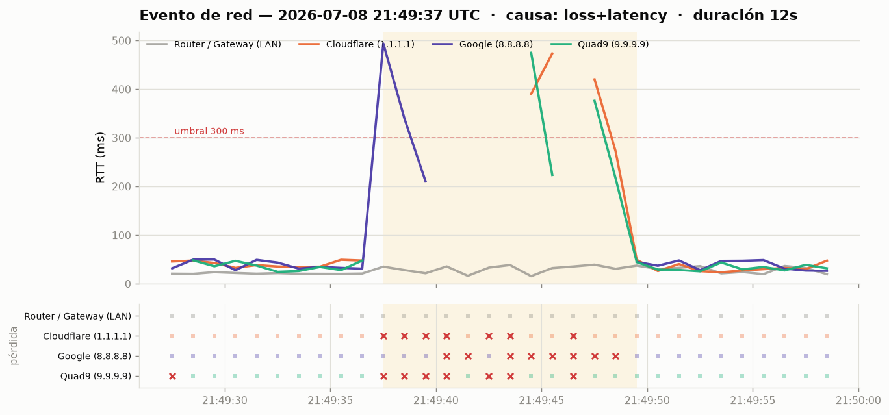

# PacketProof 📡

Monitor de **pérdida de paquetes** multiplataforma (CachyOS / Linux y Windows) pensado
para **documentar y presentar pruebas a tu ISP**.

Corre indefinidamente en segundo plano con bajo consumo, detecta automáticamente
eventos de pérdida de paquetes y picos de latencia, y guarda la **evidencia completa
de cada evento con 10 segundos de contexto antes y después**: datos crudos (JSON + CSV),
un resumen legible y un **gráfico lindo**, todo reunido en un reporte HTML listo para
mostrar.



---

## ¿Por qué sirve como prueba para el ISP?

PacketProof pinguea al mismo tiempo tu **router/gateway (LAN)** y varios **anclajes de
Internet** (Cloudflare, Google, Quad9). La clave del argumento es esta:

> Si tu **router responde perfecto** pero se **pierden paquetes hacia Internet** al
> mismo tiempo, el problema **no está en tu casa**: está del lado del ISP.

Cada evento queda registrado con fecha/hora exacta (UTC), porcentaje de pérdida por
destino y latencia, con marcas visuales de qué tramo falló.

---

## Instalación

### CachyOS / Arch Linux

```bash
git clone https://github.com/santy0254/new.git packetproof-repo
cd packetproof-repo
./scripts/install-cachyos.sh
```

Esto instala Python + matplotlib, copia la config, prueba los objetivos y registra un
**servicio systemd de usuario** que arranca solo al iniciar el sistema.

```bash
systemctl --user status packetproof     # estado
journalctl --user -u packetproof -f      # logs en vivo
```

### Windows

```powershell
git clone https://github.com/santy0254/new.git packetproof-repo
cd packetproof-repo\scripts
powershell -ExecutionPolicy Bypass -File .\install-windows.ps1
```

Crea una **tarea programada** que arranca el monitor al iniciar sesión (silencioso, con
`pythonw`, prioridad baja).

### Manual (cualquier sistema con Python 3.11+)

```bash
pip install -r requirements.txt
cp config.example.toml config.toml    # opcional: editá objetivos
python -m packetproof -c config.toml run
```

---

## Uso

```bash
python -m packetproof run        # monitorear indefinidamente (por defecto)
python -m packetproof test       # probar los objetivos una vez y salir
python -m packetproof report     # regenerar el reporte HTML
python -m packetproof simulate   # generar un evento de demostración (sin esperar)
```

Opciones útiles: `-c config.toml` (config), `-d carpeta` (dónde guardar), `-v` (verboso).

Empezá con `simulate` para ver de inmediato cómo quedan los gráficos y el reporte.

---

## ¿Qué guarda?

```
packetproof-data/
├── report.html               ← reporte agregado (abrí esto para presentar)
├── packetproof.log
└── events/
    ├── index.jsonl           ← índice de todos los eventos
    └── 20260708-214937Z/     ← una carpeta por evento (fecha UTC)
        ├── chart.png         ← gráfico del evento
        ├── event.json        ← todas las muestras (contexto ±10 s incluido)
        ├── samples.csv       ← datos crudos en planilla
        └── summary.txt       ← resumen legible
```

El **reporte HTML** muestra KPIs (cantidad de eventos, pérdida máxima, tiempo degradado),
el gráfico de cada evento y una tabla con pérdida y latencia por destino.

---

## Configuración

Todo se ajusta en `config.toml` (ver [`config.example.toml`](config.example.toml)):

| Opción | Por defecto | Qué hace |
|---|---|---|
| `interval_seconds` | `1.0` | Frecuencia de sondeo. |
| `probe_timeout_ms` | `1000` | Espera máxima por ping. |
| `pre_event_seconds` | `10` | Contexto guardado **antes** del evento. |
| `post_event_seconds` | `10` | Contexto guardado **después** del evento. |
| `latency_threshold_ms` | `300` | RTT por encima de esto = degradación. |
| `max_event_seconds` | `300` | Corte para caídas largas. |

Cada `[[targets]]` tiene `label`, `host` (o `"auto"` para el gateway) y `trigger`
(`true` = dispara eventos → Internet; `false` = referencia → router/LAN).

💡 Agregá el **primer salto de tu ISP** (visto con `traceroute 8.8.8.8` /
`tracert 8.8.8.8`) como objetivo `trigger` para ubicar dónde exactamente se pierde.

---

## Bajo consumo energético

- Un solo hilo con `sleep` entre vueltas (sin *busy-wait*).
- Los objetivos se sondean en paralelo, una vez por intervalo.
- matplotlib **solo** se ejecuta cuando ocurre un evento, no de forma continua.
- El servicio corre con prioridad de CPU/E-S baja (`Nice=10`, `IOSchedulingClass=idle`
  en Linux; prioridad 7 en Windows).

---

## Cómo funciona la detección

Máquina de estados simple: una muestra es "mala" si un objetivo *trigger* pierde el
paquete **o** supera el umbral de latencia. Al primer evento malo se abre un evento y se
adjunta el buffer rodante con los últimos 10 s. El evento se cierra cuando la red se
recupera durante `post_event_seconds` seguidos (esos segundos limpios son el "después").

---

## Desarrollo

```bash
pip install -e ".[dev]"
pytest -q
```

## Licencia

MIT — ver [LICENSE](LICENSE).
